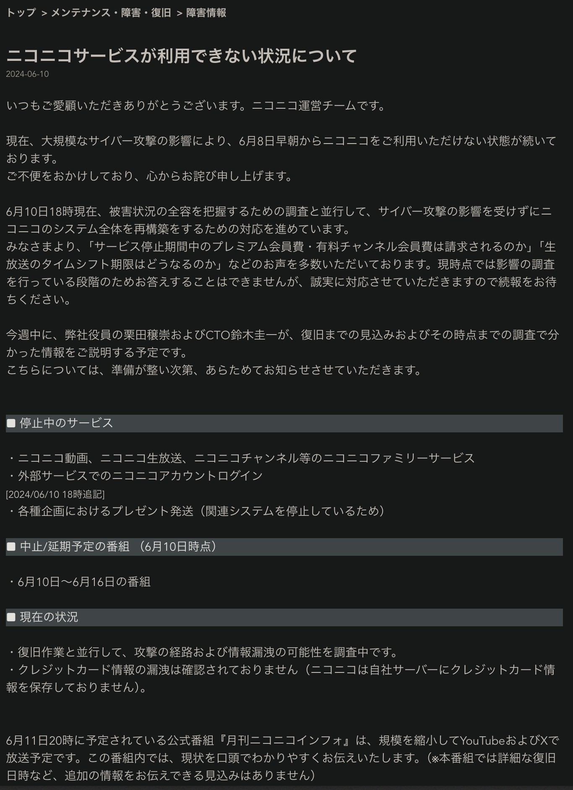

theme: Plain Jane, 2
footer: Kenji Rikitake / oueees 20240618 topic04
slidenumbers: true
autoscale: true

# oueees-202406 topic 04:
# Cloud computing basics
# Social implication of cloud computing

<!-- Use Deckset 2.0, 16:9 aspect ratio -->

^ 大阪大学基礎工学部 電気工学特別講義 2024年6月18日分 トピック04 クラウドコンピューティングの基本とその社会的影響の話を始めます。

---

# Kenji Rikitake

18-JUN-2024
School of Engineering Science, Osaka University
On the internet
@jj1bdx

Copyright ©2018-2024 Kenji Rikitake.
This work is licensed under a [Creative Commons Attribution 4.0 International License](https://creativecommons.org/licenses/by/4.0/).

^ 講師の力武 健次といいます。よろしくお願いします。

---

# CAUTION

Osaka University School of Engineering Science prohibits copying/redistribution of the lecture series video/audio files used in this lecture series.

大阪大学基礎工学部からの要請により、本講義で使用するビデオ/音声ファイルの複製や再配布は禁止されています。

^ 大阪大学基礎工学部からの要請により、本講義で使用するビデオ/音声ファイルの複製や再配布は禁止されています。ご注意ください。

---

# Lecture notes and reporting

* <https://github.com/jj1bdx/oueees-202406-public/>
* Check out the README.md file and the issues!
* Keyword at the end of the talk
* URL for submitting the report at the end of the talk

^ レクチャーノートはGitHubのこのURLに掲載しています。

---

# [fit] Cloud computing basics

^ 今回はクラウドコンピューティングの基本から話を始めます。

---

# Modern computing *is cloud computing*

^ 2010年代以降の現代のコンピュータによるサービスの大部分はクラウドコンピューティングによって提供されていると言っても過言ではないでしょう。

---
[.background-color: #ffffff]

^ クラウドコンピューティングでは、スマホからデスクトップまでの各種コンピュータから、安全にクラウド上のアプリケーションへアクセスできることが必要です。この部分のセキュリティは、現在はTLS（トランスポートレイヤーセキュリティ）などのプロトコルが提供しています。

---

# Is cloud really a uniform and single entity?

^ たいへん便利なクラウドコンピューティングですが、クラウドの中で提供しているサービスは、単一かつ統一された存在とみなしてよいのでしょうか?

---

# Absolutely not: it's an intertwined *network* of computers

^ クラウドの機能は単独のコンピュータで提供されているわけではなく、数千数万数十万のコンピュータが相互接続されたネットワークがその機能を提供しています。

---

# Web services are clusters of computers and networks

Thousands or millions of servers connected together

A physical server is separated into multiple virtual machines

^ これは2017年の京都大学学術情報メディアセンターのスーパーコンピューターの写真です。複数のサーバーがラックにマウントされていて、各々のサーバーは何十もの仮想マシンが動作しています。このようにして多数のサーバーを同時に集約して動かすということをしています。

---

# Cloud computing *is* centralization

^ クラウドコンピューティングがもたらしたものとして、コンピュータの機能の集中化があります。いわばクラウドと、それにつながる無数の端末という図式ができたわけです。

---

# An example of cloud computing: Internet of Things (IoT) and telemetering

^ クラウドコンピューティングの集中性を示す典型的な例として、IoT Internet of Things、そしてテレメータリング、日本語では遠隔測定の応用例があります。

---

[.background-color: #ffffff]

^ この図では、温度や湿度、気圧、GPS/GNSSによる位置検知など各種センサーを搭載したデバイスから計測情報をインターネットを介して送り、それらを蓄積した上でデータ解析や可視化を行うサーバーへ送るという、クラウドを通じたテレメータリングの例を示しています。

---

# Telemetering

* Mostly unidirectional (not really *the true and genuine internet*)
* Sensors/devices gathering data through internet and feed them to the servers in the cloud computing platforms
* *The servers compute*
* *Extremely centralized*

^ テレメータリングの特徴として、データの流れが一方向でありインターネットの双方向性を利用していないこと、そしてサーバーにデータを集中させた上で解析しているということがあります。昨今のGenerativeあるいは生成AIのためのモデル作りでも、このようにして収集された大量のデータが多かれ少なかれ活用されており、いわばテレメータリングがあって初めて生成AIが実用に耐えるものになったといっても過言ではないでしょう。

---

# [fit] Social implication of cloud computing

^ ここからはクラウドコンピューティングが与えた社会的影響について考えていきます。

---

<!-- talk contents here -->
## Centralized social behavior accerelated by cloud computing

* Sharing *everything* - no privacy
* *Panopticon* [^1] style of governance, filtering, *censorship, or autocracy*
* Complete *externalization* of resources, leading to *no personal control*

[^1]: n. a circular prison with cells arranged around a central well, from which prisoners could at all times be observed. (New Oxford American Dictionary, Apple macOS 10.13.6)

^ クラウドコンピューティングが社会的に見て中央集権の動きを加速させたことは疑いのない事実です。スマートフォンやタブレットをテレメータリングのデバイスとしても活用することで、個人の活動データがどんどんクラウド側に溜まっていくようになりました。このデータを個人がコントロールすることはもはや大変困難です。そして「シェアする」という日本語が普及したことからもわかるように、あらゆる写真や動画が共有されプライバシーが失われる状況になっています。

---

# Presidio Modelo: a panopticon prison

^ クラウドコンピューティングがもたらしたような徹底した中央集権による監視という統治のやり方は、パノプティコンという18世紀の刑務所の設計にさかのぼります。パノプティコンでは、中央にいる監視者から円の縁にいる囚人を一望で監視できます。この写真に写っているのは、1920年代にキューバにつくられたPresidio Modeloというパノプティコン設計の刑務所です。現在は博物館になっているそうです。

---

[.background-color: #ffffff]

^ この左右に示した2枚の絵ですが、左側はベンサムによる最初のパノプティコンの設計図です。一方、右側の絵は、貧しい人達を収容していたやり方が下側のより自由を認めていたコの字型の家の配置から、上側のパノプティコンさながらの監視と統制が強化された配置に変わったのを表しています。

---

# INGSOC: the slogans [^2]

* War is peace
* Freedom is slavery
* Ignorance is strength

* Independent thinking = *thoughtcrime*

## NOTE: this is a *fiction*!

[^2]: George Orwell, "Nineteen Eighty-Four", 1949.

^ 監視と統制ということについては、第二次大戦後すぐに書かれたオーウェルの「1984年」という小説が有名です。この中ではINGSOC（イングソック）という支配者の組織が出てきますが、そのスローガンは「戦争とは平和である」「自由とは奴隷の状態である」「無知は力である」となっていて、独立した思考を行うことは「思想犯罪」(thoughtcrime)として取り締られます。これはフィクションではあるのですが、中央集権が進み自由が失われた独裁的国家のやり方を象徴している典型例といえます。

---

# Historical examples of INGSOC-like nations

* Nazi Germany [^3]
* Empire of Japan [^4] (Japan in 1868-1947)
* Soviet Union [^5] 
* ... you can pick up many nations currently existing

[^3]: <https://en.wikipedia.org/wiki/Nazi_Germany>

[^4]: <https://en.wikipedia.org/wiki/Empire_of_Japan>

[^5]: <https://en.wikipedia.org/wiki/Soviet_Union>

^ INGSOCのような支配を行っていた歴史的な国家としては、第2次大戦のナチス・ドイツ、明治維新から現在の日本国憲法が施行されるまでの大日本帝国、現在のロシアおよびその周辺に存在したソビエト社会主義共和国連邦があります。そして今現在も同様の支配を行っている国家は少なくありません。

---

# [fit] Why cloud computing has become
# [fit] so *dystopian*?

^ ずっと中央集権のもたらす弊害について話してきました。なぜクラウドコンピューティングはここまでディストピアな印象を持つようになってしまったのでしょうか。

---

# We have sold freedom for *convenience*

* Ubiquitous/global accessibility
* Concentrated data for easy analysis
* Easy control of the information flow
* No extra cost for sharing
* No need to think about where the information locates
* A useful tool for fascist and despotic regimes

^ 一つの理由として、人類は手軽さのために自由を売り渡してしまった、ということはあると私は思っています。場所を問わずにアクセスできること、データを集めることで分析が容易になること、情報の流れを簡単に制御できること、シェアするのに追加の手間がいらないこと、そしてどこに情報があるのかについて考えなくてもいいこと、というのがこの手軽さの実態でした。またファシストや専制独裁態勢にとって中央集権型のシステムが利用しやすい道具となったことも影響していると思います。

---

# The inconvenient truth of centralized systems: what if the core/cloud fails?

^ とはいえ、中央集権型システムにも弱点はあります。中心あるいはクラウドが止まったらどうするかということです。

---

## Niconico's ongoing shutdown since 8-JUN-2024

* Niconico has been down due to possible cyberattack [^6]
* If an cloud instance is found compromised, *all the other instances on the same platform must be verified uncompromised*, or otherwise those instances might also be actually compromised
* Other sites compromised presumably on the same cloud system: KADOKAWA

[^6]: Screenshot from <https://blog.nicovideo.jp/niconews/225099.html> on 0103UTC 11-JUN-2024, taken by Kenji Rikitake

---

## Inconvenience of centralized systems

* Ubiquity or *no accessibility*
* When the core fails, no alternative
* When the core loses data, *no backup*
* The system performance is restricted by the capability of the core
* Endpoint systems will lost *all capabilities*

^ 集中型システムの欠点を考えてみます。中心が止まれば何もアクセスできなくなってしまいます。代わりもありません。中心がデータを失えば、バックアップも存在しません。システムの性能は中心部の性能で制限されます。そしてそれにぶら下がっている末端のシステムは中心に依存したすべての機能を失ってしまいます。

---

# Centralized systems are *not* sustainable

## ...then how cloud computing systems manages the sustainability?

^ そういう意味では、集中型のシステムは持続可能性は低いのです。しかし実際にはクラウドコンピューティングのシステムは一定レベルの持続可能性を維持しています。その方法はどのようなものでしょうか。

---

# Distributed systems provide sustainability and resilience against failures

^ 次回のトピックでは、各種の障害への耐性を持たせ、システム全体の持続可能性を高めるための分散システムについて話します。今回のトピックの話はこれで終わります。この後にキーワードがあります。

---

# Photo and image credits

* All photos and images are modified and edited by Kenji Rikitake
* Photos are from Unsplash.com unless otherwise noted

* Presidio Modelo Prison: By Friman [Public domain], from [Wikimedia Commons](https://commons.wikimedia.org/wiki/File:Presidio_Modelo.JPG)
* Panopticon: Jeremy Bentham, Public domain, via [Wikimedia Commons](https://commons.wikimedia.org/wiki/File:Panopticon.jpg)
* Contrasted Residences for The Poor: By Augustus Pugin [Public domain], via [Wikimedia Commons](https://commons.wikimedia.org/wiki/File:Contrasted_Residences_for_the_Poor.jpg)
* Modern Computing is Cloud Computing: Rayi Christian Wicaksono
* Cloud Computing: <https://commons.wikimedia.org/wiki/File:Cloud_applications_SVG.svg>, licensed under [Creative Commons CC0 1.0 Universal Public Domain Dedication](https://creativecommons.org/publicdomain/zero/1.0/deed.en)
* Intertwined network of computers: <https://en.wikipedia.org/wiki/File:Cloud_Computing.jpg>, licensed under [Creative Commons CC0 1.0 Universal Public Domain Dedication](https://creativecommons.org/publicdomain/zero/1.0/deed.en)
* Web services are clusters of computers: Kenji Rikitake, at Kyoto University ACCMS, April 2017

<!--
Local Variables:
mode: markdown
coding: utf-8
End:
-->
