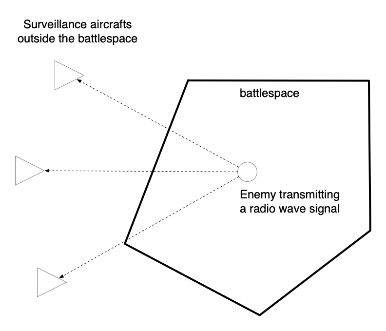

theme: Plain Jane, 2
footer: Kenji Rikitake / oueees 20250624 topic06
slidenumbers: true
autoscale: true

# oueees-202506 topic 06:
# [fit] 
# [fit] Wireless/radio and internet
# [fit] Information warfare and radio surveillance
# [fit] "Artificial Intelligence" and the reality

<!-- Use Deckset 2.0, 16:9 aspect ratio -->

^ 大阪大学基礎工学部 電気工学特別講義 2025年6月24日分 トピック06 無線とインターネット、情報戦と無線による監視、そしてAIとその現実についての話を始めます。

---

# Kenji Rikitake

24-JUN-2025
School of Engineering Science, The University of Osaka
On the internet
@jj1bdx

Copyright ©2018-2025 Kenji Rikitake.
This work is licensed under a [Creative Commons Attribution 4.0 International License](https://creativecommons.org/licenses/by/4.0/).

^ 講師の力武 健次といいます。よろしくお願いします。

---

# CAUTION

The University of Osaka School of Engineering Science prohibits copying/redistribution of the lecture series video/audio files used in this lecture series.

大阪大学基礎工学部からの要請により、本講義で使用するビデオ/音声ファイルの複製や再配布は禁止されています。

^ 大阪大学基礎工学部からの要請により、本講義で使用するビデオ/音声ファイルの複製や再配布は禁止されています。ご注意ください。

---

# Lecture notes and reporting

* <https://github.com/jj1bdx/oueees-202506-public/>
* Check out the README.md file and the issues!
* Keyword at the end of the talk
* URL for submitting the report at the end of the talk

^ レクチャーノートはGitHubのこのURLに掲載しています。

---

# [fit] Wireless/radio and internet

^ まず最初に無線とインターネットの話から始めます。

---

# [fit] Direct wired network at the maximum extent
# [fit] This is the old Stockholm telephone tower in 1890 (see Topic 02)

^ これはトピック02でもお見せしましたが、直接線を引くというのがいかに大変かということを示すよい例だと思います。19世紀末のストックホルムではこんなことをやっていたのですね。

---

# [fit] Lessons learned: wired networks do not necessarily scale well

* Difficult to install, often impossible
* Easily get cut/disconnected by accidents
* Difficult to reconfigure/rewire
* Individual link management is complex and often erratically done

^ ここで教訓として学ぶべきことは、有線のネットワークは設置が大変で、不可能な場合もしばしばあります。そして事故や攻撃で簡単に切断されてしまいます。一度切られてしまうと、正しい接続相手を見つけるのが一苦労で、再接続が大変です。そしてどの線がどの接続に対応しているのかの管理も複雑で、しばしば間違っているなんてこともあります。スマホは全部どこかに線を差し込まないと使えないという状況だったら、こんなに普及はしなかったですよね。

---

# [fit] Remove the wire!

^ それならば、線を引かないで済むネットワークを考えよう、という考え方も出てくるわけです。

---

# [fit] Wireless/radio networks
# [fit] as a replacement of wired networks

^ この考え方の下で、無線のネットワークを有線のネットワークの代わりに使おうというのが、最近一般的になってきています。

---

# Limitations of radio networks by physics

* Speed limited by radio frequency bandwidth
* Latency increased by (de)modulation and packetization
* Excessively large error rate due to obstacles (burst errors), fading, interference, and etc.: *Error-correction encoding required*
* Radiation spillover causes content disclosure: *encryption required*
* The source of interference is immensely difficult to locate
* Still requires a lot of wiring to the base stations

^ 無線ネットワークには、物理的な制約が多くあります。使える周波数帯域で伝送速度が制限されますし、電波に乗せるための変復調やパケット化といった作業によって遅延が増えます。そして混信妨害やフェージング、障害物などで長時間のバースト誤りが発生するため、誤り訂正符号が必要になります。電波は特定の相手だけに飛ばすということはできなくて、漏れは必ずありますから、内容を秘匿するために暗号化が必要です。そして妨害があるとその発信源を探知するのは非常に難しくなります。さらに、無線の基地局ネットワークを作るために、いっぱい線を引かなければなりません。

---

# [fit] Advantages of radio networks:
# [fit] Mobility

* Providing connections to where no wires can connect
* Nodes can move around while maintaining the connectivity

^ それでも、無線には移動可能という重要な利点があります。線ではつなげない場所に通信のコネクションを提供できますし、接続性を保ちながら動き回るということができます。

---

# [fit] Implementation issues to overcome for 5G era:
# [fit] Low channel capacity and short reachability 

* Trade-off between frequency bandwidth, reachable range, and base station installation
* Massive interference between nodes and networks
* Latency issues due to (de)modulation will persistently remain

^ 最近5Gという携帯端末の通信方式が社会で実現されつつあります。広帯域低遅延を5Gはうたっていますが、そのためには高い周波数で多くの帯域を使わなければならないため、従来の4Gに比べて波長が短くより多くの伝送エネルギーを必要とします。基地局からの到達距離も短くなりますし、ネットワーク同士の混信も増えます。変復調装置による遅延の問題は引き続き残ります。これらの問題のため、5Gの普及にはまだまだ時間がかかると思います。

---

# [fit] Information warfare
# and
# [fit] radio surveillance

^ ここからは情報戦と無線による監視あるいはサーベイランスについて話していきます。

---

# Information warfare

> Information warfare (IW) (as different from cyber warfare that attacks computers, software, and command control systems) is a concept involving the battlespace use and management of information and communication technology (ICT) in pursuit of a competitive advantage over an opponent. 
-- Wikipedia [^1]

[^1]: <https://en.wikipedia.org/wiki/Information_warfare>

^ 情報戦とは、主にコンピュータを相手とするサイバー攻撃とは違い、戦場における情報そのものや情報通信技術の利用や管理を通じて敵に対して優位に立つための考え方をいいます。もっとも、最近は普段の生活があまりにも情報戦に近くなっているため、戦場も平時も大きな差はなくなっているといえるかもしれません。

---

# What Russo-Ukraine War has revealed so far as of June 2025

^ 情報戦の例として、2025年6月までのロシア=ウクライナ戦争でわかったことのうちいくつかを紹介します。

---

# *DON'T: blindly trust your own physical transportation network*

Operation Spiderweb [^0] revealed the physical-world Trojan Horse actually worked (if carefully prepared)

Dead reckoning with open-source software ArduPilot and AI recognition of the target made the sneak attack successful

[^0]: Operation Spiderweb, <https://en.wikipedia.org/w/index.php?title=Operation_Spiderweb&oldid=1296695523> (last visited June 22, 2025).

^ 2025年6月1日にOperation Spiderwebというウクライナによるロシアの航空基地に対する攻撃作戦が行われ、ロシアは多くの戦略爆撃機などを失いました。この作戦はロシア領内での普通の貨物を模した木製の箱から遠隔操縦のドローンを発進させて近くの基地にある航空機を破壊するという攻撃でした。「トロイの木馬」の現代版と言えます。この攻撃ではArduPilotというオープンソースのソフトウェアや外部の情報に頼らない推測航法(dead reckoning)、そして操縦できなくなったときに備えてAIによる標的認識を組み合わせるという緻密な戦術の構築が作成成功に繋がったと言えます。

---

# *DON'T: unencrypted communications are still widely used in the battlespace (?!)*

Unencrypted communications are thoroughly monitored and actually exploited to neutralize weapons, soldiers and commanders: many commanders of Russian Forces became KIA [^2]

All radio airwaves are heard and can be heard from several hundred kilometers (or even more from satellites or through the ionospheric propagation)

[^2]: Killed in Action (NATO definition) Wikipedia: <https://en.wikipedia.org/wiki/Killed_in_action>

^ 未だに戦場で暗号化されていない通信が日常的に行われていたというのは驚きでした。当然これらは盗聴されて、武器や兵士、司令官の無力化に使われるわけです。実際ロシア軍の司令官が戦死した(KIA)という話もあります。また、何百キロメートルも離れたところから無線の傍受はできています。衛星からの傍受もあれば、偵察機による傍受、そして電離層伝搬によるものもあります。

---

# Locating enemies by triangulation from outside the battlespace

Aircrafts outside the battlespace can find the direction of the incoming signal

Aggregating the reception timing difference information of three (3) or more aircrafts receiving the signal for the enemy, the position of the enemy can be precisely estimated (four (4) or more for also locating the altitude) [^3]

[^3]: Hyperbolic navigation / Wikipedia: <https://en.wikipedia.org/wiki/Hyperbolic_navigation>

^ 戦場の外から三角測量で敵を特定するという行為も日常的に行われています。3機以上の飛行機が信号を受信することで、その時間差を使って平面上の位置を特定できます。4機あれば高度も特定できます。これは双曲線航法といって、昔から使われている方法です。

---

# DO: use jamming-proof communication methods

> "A bird’s nest incorporating fiber optic cable is a striking sign of how much debris from fiber-guided FPVs now litters the landscape of Ukraine." [^4]

This shows a critical change of communication

*wired* communication is essential to prevent *radio jamming*

[^4]: David Hambling, [Fiber Optic Bird’s Nest Heralds A Fiber Drone Summer In Ukraine](https://www.forbes.com/sites/davidhambling/2025/06/06/fiber-optic-birds-nest-heralds-a-fiber-drone-summer-in-ukraine/), Forbes, June 6, 2025

^ 2025年6月のForbesの記事では、ウクライナの戦場において光ファイバーで作られた鳥の巣が頻繁に見付かっている、という話が紹介されていました。敵からの無線による妨害つまりジャミングの影響を排除するために、あえて軽量の光ファイバーを使い有線で操縦するドローンが大量に使われています。1979年の初代ガンダムではミノフスキー粒子という架空の物質により戦場では電波による無線通信が使えなくなるという設定がありましたが、もはやそれは現実になったということがいえるでしょう。言い換えれば、ジャミング対策のできない通信技術は戦場では無力だということです。

---

# *DON'T: smartphone and cell phone networks are NOT protected end-to-end and can be monitored!*

Using a SIM card provided by *the adversaries* on your smartphone means all your communication contents are *thoroughly wiretapped and can be exploited against you!*

TLDR: *don't use a SIM card dropped on the floor or given by an untrusted person!* 

Corollary: *don't use an USB memory or a MicroSD card dropped on the floor or given by an untrusted person!*

^ スマホや携帯のネットワークはその事業者に常に傍受されていて内容もつつ抜けになっている、ということも明らかになりました。敵地のSIMカードを使うというのはこの点では論外の危険行為です。同様の理由で拾ったり知らない人にもらったSIMカードを使ってはいけません。USBメモリやSDカードも知らない人にもらったものや拾ったものを使ってはいけません。どんなマルウェアが紛れ混んでいるかわかりませんし。

---

# DO: always use encryption during (or even not during) the war

Modern TLS and HTTPS encryption is strong enough to thwart an attempt to eavesdrop the communication

Using a strong end-to-end encryption (E2EE) such as OpenPGP and GnuPG is a plus (though the user interface is still clumsy)

*NOTE WELL AND CAUTION: "safe" messaging services are not necessarily really so*, especially the centralized ones!

^ 幸いにして、TLSやHTTPSといった暗号は、正しく実装されていれば盗聴のための傍受攻撃に対して十分に保護の役目をするということがいえます。OpenPGPやGnuPGという強力な暗号ツールを使えばさらに安全度は高まるでしょう。ただし、世の中で「安全」をうたっているメッセージサービスは安全ではないものも多いです。中央集権型のサービスはそういう意味では安全たり得ません。

---

# TLDR: your radiowave emission can be monitored by unwanted and untrusted people and can be exploited and used against you at any time. You have been warned.

^ ここまでをまとめると、電波を出している限り信頼できない人がそれを傍受する可能性があり、その傍受内容は常に発信者に対して不利益をもたらすように使われる可能性があるということです。スマホは常に電波を出しているので特に注意が必要です。

---

# Wartime social engineering: how to *lie*

Fake photographs are all around from the beginning of the war [^5] and it's continuing [^6]: *old images and videos are falsely quoted* as the ongoing ones

Claiming something without evidence and related facts are so common among all stakeholders of the war, and this is how war propaganda is conducted; see what Japan had done in World War II [^7]

[^5]: BBC News, 25 February 2022, [Ukraine conflict: Further false images shared online](https://www.bbc.com/news/60528276)

[^6]: France24.com, 06/06/2023, [Nova Kakhovka dam breach: Old image resurfaces to falsely illustrate today's damage](https://www.france24.com/en/tv-shows/truth-or-fake/20230606-nova-kakhovka-dam-breach-old-image-resurfaces-to-falsely-illustrate-today-s-damage)

[^7]: Wikipedia contributors, [Propaganda in Japan during the Second Sino-Japanese War and World War II](https://en.wikipedia.org/w/index.php?title=Propaganda_in_Japan_during_the_Second_Sino-Japanese_War_and_World_War_II&oldid=1158927730), Wikipedia, The Free Encyclopedia, 7 June 2023, 03:40 UTC [accessed 13 June 2023]

^ 戦争が長期化するにつれ、どうやってウソを付くか、というパターンを見抜くことも必要になってきました。今や画像や動画は簡単に偽造できるので、フェイク画像や動画が引用されて現実に起こっていることであるかのように扱われることが増えてきています。そして戦争では何かを証拠や関連する事実といった根拠を示さずに主張することが日常になりました。これを戦争プロパガンダといいます。第二次大戦での大日本帝国も同じことをやっていました。

---

# Finding the truth where totally conflicted views are presented [^8]

* Check credentials: do the background check of the author
* Look for the bias in the presented views and your own detection bias
* Evaluate the source: reputation of the past publishing
* Apply critical thinking: questioning ideas and assumptions
* Consider relativistic reasoning than pursuing singular truth

[^8]: A summary of [an answer by perplexity.ai with the question "Can you tell me how to find the truth where totally conflicted views are presented?"](https://www.perplexity.ai/search/00018c73-c45c-46f7-81fa-bd78c2301286)

^ いくつかの相矛盾する見方が示された時にどのように真実に辿りつくか、ということが、情報戦の時代には重要になってきます。発信元の素性を調べたり、主張に偏見がないか、そして主張を判断する人自身に偏見がないかを常に確認しなければなりません。過去発表された意見への評価も大事です。また主張の中身や前提を疑うクリティカルシンキングも必要です。世の中には唯一の真実はなく、価値は相対的なものという判断を行うことも大事になります。

---

# "Artificial Intelligence" (AI)
# and the reality

^ ここからは人工知能あるいはAI、そしてその現実について話します。

---

# Fundamental question: 
# *is intelligence only for human?*

^ まず基本的な質問として、「知能は人間だけが持つものか?」ということを提示したいと思います。そもそも知能とは何かという定義上の問題もありますが。この講義では答は出しません。いろいろな見解があると思います。

---

# AI as a buzzword in computer science (1/2) [^9]

* LISP and "symbolic" (text) processing (1950s)
* AI Winter in the 1970s
* Logic programming / expert systems (1980s)
 - Japan: The Fifth Generation Computer Systems (1982-1994)
* AI Winter in the 1990s

[^9]: Wikipedia contributors, [History of artificial intelligence](https://en.wikipedia.org/w/index.php?title=History_of_artificial_intelligence&oldid=1159316271), Wikipedia, The Free Encyclopedia, 9 June 2023, 15:53 UTC [accessed 13 June 2023]

^ AIという単語はコンピュータサイエンスの中で何度もバズワードとして出てきました。1950年代には文字列の処理、当時は記号処理といったプログラミングのために、LISP言語が登場しました。その後1980年代には日本が主導した第5世代コンピュータプロジェクトなど、論理プログラミングやエキスパートシステムをAIとして扱う流儀が流行りました。とはいえ、AIの実現には膨大な計算機の力が要るため、1970年代と1990年代には「AIの冬」と呼ばれる停滞期を迎えています。

---

# AI as a buzzword in computer science (2/2)

* Breakthrough made by large-scale computing
  - Internet, massive parallelism, cloud computing
* Since 2010s: generative AI
  - Machine learning -> deep learning
  - Massive "big data" from the internet
  - Large language models (LLMs) (e.g., GPT-4, ChatGPT)

^ その後大規模計算のための技術が著しく進歩したことで、2010年代からは、現在のChatGPTなどの基礎技術である生成AI(generative AI)の実用化が進んでいきます。インターネットや大規模並行並列計算、クラウドコンピューティングなどで集めて処理された大量のデータをもとに、機械学習とそれを発展させた深層学習のモデルを作ることができるようになり、その中の大規模言語モデル(LLM)として今のChatGPTの背景であるGPT-3やGPT-4が出てきています。

---

# The (non-)goals of current AI

* *Non-deterministic* problem solving
  - Probabilistic answers computed by neural networks
  - Questionable reproducibility
  - *Errors may quite often occur*
* *No one really knows why* LLMs work and what they actually do
  - You cannot *fully logically* explain the behavior

^ 今の生成AIが何を目指しているかについて述べます。基本的にはニューラルネットワークによる確率的に確からしい非決定的な出力を出すようにAIはできています。ですからしばしば間違えますし、同じ答を必ず出してくれるわけではありません。そしてLLMが中で何をやっていてどうして出力が出てくるかについては誰も理解していない、というのがAI研究者の人達の見解です。言い換えれば、完全に論理的にLLMのふるまいを説明できるわけではありません。ここが従来の「コンピュータは必ず正しい結果を出す」という思い込みを捨てなければならないところです。

---

# Generative AI can only assume answers

* Don't: expect the definitive answers
* Do: treat the output as the *synthesized* summary
  - The behavior is limited by the *given data*
  - Prompting (directives by words) largely affects the output
* Do: review the output by yourself
* *Don't: blindly believe the answers!*
* *Also don't: use the output without proper citation*

^ 生成AIができることは、せいぜい答を推測することでしかありません。決定論的な答を期待してはいけないと思います。一方で、生成AIの出力は入力を合成してまとめたものといえますし、プロンプトという指示の与え方で大幅に出力は変わります。出力結果は使用者が自分でレビューすることが必要ですし、そのまま信じてはいけないものです。また、AIの出力結果は使ったAIの名前などを適切に引用することが必要です。今回のトピックの話はこれで終わります。この後にキーワードがあります。

---

# Photo and image credits

* All photos and images are modified and edited by Kenji Rikitake
* Photos are from Unsplash.com unless otherwise noted
* Free Wifi Inside: [Photo by Bernard Hermant](https://unsplash.com/photos/X0EtNWqMnq8)
* Pedestrians: [Photo by Ryoji Iwata](https://unsplash.com/photos/IBaVuZsJJTo)

<!--
Local Variables:
mode: markdown
coding: utf-8
End:
-->
