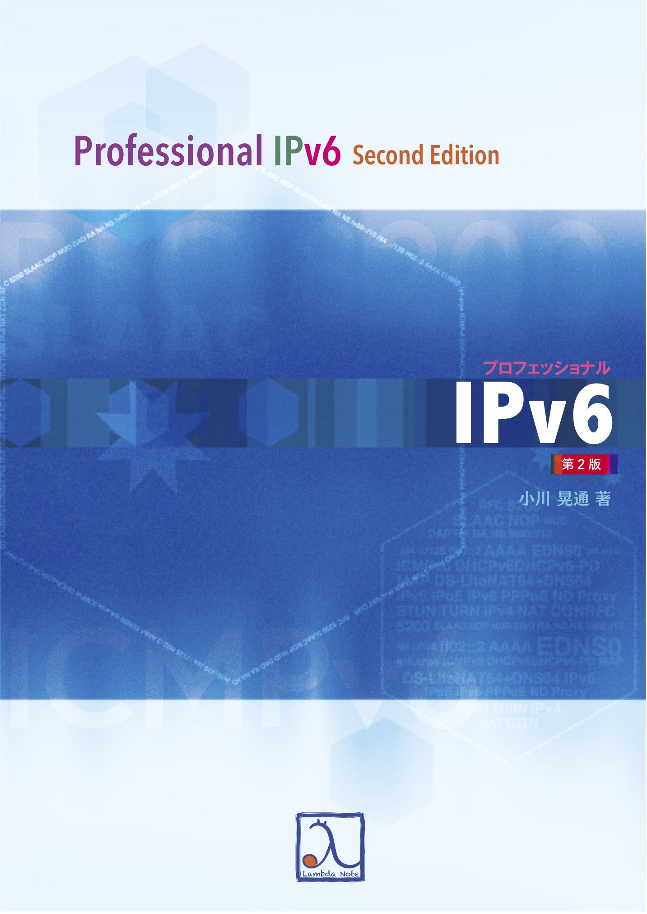
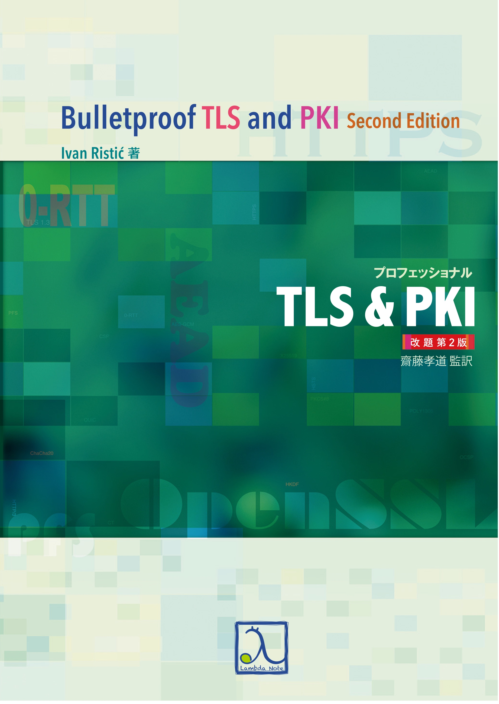

theme: Plain Jane, 2
footer: Kenji Rikitake / oueees 20240618 topic07
slidenumbers: true
autoscale: true

# oueees-202406 topic 07:
# Reference for further study
# Choosing your career and professionality

<!-- Use Deckset 2.0, 16:9 aspect ratio -->

^ 大阪大学基礎工学部 電気工学特別講義 2024年6月18日分 トピック07 講義の参考文献と社会人になった後の進路の選び方についての話を始めます。

---

# Kenji Rikitake

18-JUN-2024
School of Engineering Science, Osaka University
On the internet
@jj1bdx

Copyright ©2018-2024 Kenji Rikitake.
This work is licensed under a [Creative Commons Attribution 4.0 International License](https://creativecommons.org/licenses/by/4.0/).

^ 講師の力武 健次といいます。よろしくお願いします。

---

# CAUTION

Osaka University School of Engineering Science prohibits copying/redistribution of the lecture series video/audio files used in this lecture series.

大阪大学基礎工学部からの要請により、本講義で使用するビデオ/音声ファイルの複製や再配布は禁止されています。

^ 大阪大学基礎工学部からの要請により、本講義で使用するビデオ/音声ファイルの複製や再配布は禁止されています。ご注意ください。

---

# Lecture notes and reporting

* <https://github.com/jj1bdx/oueees-202406-public/>
* Check out the README.md file and the issues!
* Keyword at the end of the talk
* URL for submitting the report at the end of the talk

^ レクチャーノートはGitHubのこのURLに掲載しています。

---

# [fit] Reference for further study

^ この講義ではインターネットの情報伝送についてお話しました。さらに深く調べたい人達への参考文献を紹介します。

---

# 基礎からわかるTCP/IPネットワークコンピューティング入門 第3版

- オーム社 ISBN 9784274050732
- [達人出版会の電子書籍](https://tatsu-zine.com/books/kiso-tcpip-nwcp3)

^ この本はインターネットの基本的なことが網羅的に記述されています。通して読むことでインターネットの全体像がわかるかと思います。

---

# プロフェッショナルIPv6 第2版

- ラムダノート ISBN 9784908686115
- [ラムダノートの紙の本+電子書籍](https://www.lambdanote.com/products/ipv6-2)
- [Boothの無料版](https://professionalipv6.booth.pm/items/913273)
- 昨年2021年に第2版が刊行されました

^ この本はIPv6がIPv4から変わったところ、そしてIPv6固有のプロトコル仕様等について広く深く書かれています。無料版もあります。

---

# プロフェッショナル TLS&PKI 改題第2版

- ラムダノート ISBN 9784908686191
- [ラムダノートの紙の本+電子書籍](https://www.lambdanote.com/collections/tls-pki-2/products/tls-pki-2)
- [無料の抜粋版「OpenSSLクックブック」](https://www.lambdanote.com/products/openssl)

^ この本はWebなどで広く使われている暗号技術TLSや公開鍵基盤PKIの詳細について書かれています。最新版では現行のTLS 1.3、そして公開鍵基盤のセキュリティ、実装、運用について網羅的に書かれています。

---

# [fit] Choosing your career and professionality

^ 講義の最後に、これから必要なキャリアや専門性について、私の思うところを述べます。

---

 When I chose my career and professionality?

* Age 9: computers and English
* Age 10: ham radio and electronics
* Age 14: writing commercial software
* *Age 23: finally decided to make my living on my computer software professionality, with my English proficiency*

^ 私は9歳でコンピュータと英語に触れ、10歳でアマチュア無線と電子技術を学び始め、14歳で初めて売れるソフトウェアを書きました。そして学士卒の23歳の時に英語とコンピュータで食って行こうという覚悟を決めました。もちろんいろいろ迷うこともありました。仕事を始めたのは修士を出た25歳からです。他にも音楽とか好きなことはいくつかあったんですが、結局得意なことで食べていくのが良いかなと思ってそうしました。幸い時代の波に乗れたこともあり、食いっぱぐれてはいません。

---

# If I were at age 22 now, what I would do after getting a Bachelor's degree?

* Get out of Japan ASAP
* Explore the computer skills
* Do something unpopular

# [fit] Go abroad

^ 私がもし現在22歳で学部を卒業したら何をするかと聞かれたら、まず日本から出ることを考えます。日本はとても住みやすい国ですが、日本の中だけにいると、世界の状況は見えませんし、もう日本の中だけでお金を稼げる時代ではなくなっています。世界での日本の地位は私達が思うよりずっと低いのです。ぜひ言葉の違う世界に出ていってください。そして自分であればコンピュータのスキルを磨きながら、他人のやらないことをやると思います。残念ながら自分は健康を害したので9歳から10歳の渡米生活以外で海外で暮らしたことはないのですが、機会があればぜひ海外で生活してみることをお勧めします。

---

# What are the most important things to pursue engineering/scientist career?

* Physical strength
* Mental strength
* Curiosity

# [fit] Curiosity matters

^ 基礎工学部の皆さんはエンジニアか科学者のキャリアを目指している人達が多いと思います。そのために一番大事なのはまず体力と健康で、次にメンタルの強さと精神の安定だと思います。ここまではどの職業でも変わらないでしょう。これに加えて大事なことがあるとしたら、それは好奇心だと思います。好奇心を持ち続けてこと、新しいことに常にかつ長く一生取り組むことができます。

---

# An inconvenience truth: participation in a war

* War begins abruptly: see Ukraine and Gaza
* Escalation of conflicts is predictable, however
* Japan has already engaged in many wars
* Question: *do you participate in a war?*

^ ここ数年感じていることですが、最後に一つ不都合な真実について話しておきます。それは「戦争に参加するかどうか」ということについてです。戦争は突然始まるものです。2022年のロシアによるウクライナ侵攻、2023年のハマスによるイスラエル攻撃およびそれに対するイスラエルからの無差別反撃などを見ればわかるでしょう。しかし、紛争がどのように激化して戦争になるかは、ある程度予想がつきます。日本はすでに多くの戦争に対して国としての立場を明確にしています。この講義の最後の質問として、「あなたは戦争に参加しますか?」という問いをします。これは私自身の問題でもあります。日本は1945年8月の敗戦から徴兵制は実施していませんが、この状況が未来永劫続くとは限りません。この講義の受講者の多くは技術の道を目指していると認識していますが、技術は戦争の道具でもあります。戦争とどのようにかかわるかは、誰にとっても今後の人生において避けられないテーマであると思います。これにてこのトピックを終わります。この後にキーワードがあります。

<!--
Local Variables:
mode: markdown
coding: utf-8
End:
-->
